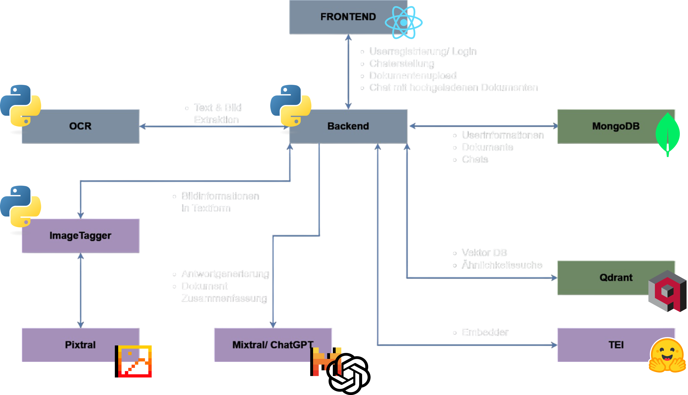

# Odyss.AI 
Odyss.AI ermöglicht das Hochladen von Dokumenten und das Stellen von Fragen zu deren Inhalten. Mithilfe von Mistral und Pixtral werden relevante Informationen extrahiert und verständlich aufbereitet.

### ✨ Funktionen
- 📂 Dokumente hochladen (PDF, DOCX, PPX usw.)
- 🤖 Fragen zu den Dokumenten stellen
- 🔍 Schnelle und präzise Antworten basierend auf dem Inhalt
- 🛠 Einfache Nutzung über die Web-Oberfläche
- 🚀 Starte jetzt und lass die KI deine Dokumente für dich durchsuchen!

## Inhaltsverzeichnis
- [Übersicht🥽](#installation)
- [Installation⚙️](#übersicht)
- [ToDos🎯](#todos)

## Übersicht🥽


## Installation⚙️
### Installation VMware 
https://support.broadcom.com/group/ecx/productdownloads?subfamily=VMware+Workstation+Pro

### Setup neue Virtual Machine
#### Erstelle eine neue VM mit Ubuntu Linux (downloade die entsprechende ISO Datei)
#### Installiere Git: sudo apt install git
#### 🐳 Docker und Docker Compose auf Ubuntu installieren
- 1.1 Paketliste aktualisieren und Abhängigkeiten installieren
```bash
sudo apt update
sudo apt install -y ca-certificates curl gnupg
```
- 1.2 Docker GPG-Schlüssel hinzufügen
```bash
sudo install -m 0755 -d /etc/apt/keyrings
curl -fsSL https://download.docker.com/linux/ubuntu/gpg | sudo tee /etc/apt/keyrings/docker.asc > /dev/null
sudo chmod a+r /etc/apt/keyrings/docker.asc
```
- 1.3 Docker-Repository hinzufügen
```bash
echo "deb [arch=$(dpkg --print-architecture) signed-by=/etc/apt/keyrings/docker.asc] https://download.docker.com/linux/ubuntu $(lsb_release -cs) stable" | sudo tee /etc/apt/sources.list.d/docker.list > /dev/null
sudo apt update
```

- 1.4 Docker installieren
```bash
sudo apt install -y docker-ce docker-ce-cli containerd.io docker-buildx-plugin docker-compose-plugin
```
- 1.5 Überprüfung der Installation
```bash
docker --version
```
- 1.6 (Optional) Docker ohne `sudo` verwenden
```bash
sudo usermod -aG docker $USER
newgrp docker
```

---

- 2.1 Neuste Version von Docker Compose abrufen und installieren
```bash
LATEST_VERSION=$(curl -s https://api.github.com/repos/docker/compose/releases/latest | grep tag_name | cut -d '"' -f 4)
sudo curl -L "https://github.com/docker/compose/releases/download/${LATEST_VERSION}/docker-compose-$(uname -s)-$(uname -m)" -o /usr/local/bin/docker-compose
sudo chmod +x /usr/local/bin/docker-compose
```
- 2.2 Überprüfung der Installation
```bash
docker-compose --version
```

---
- 3. Docker-Dienst aktivieren (optional)
Falls Docker nicht automatisch startet:
```bash
sudo systemctl enable --now docker
```

---

✅ **Fertig!** Jetzt kannst du Docker und Docker Compose auf deinem Ubuntu-System nutzen. 🚀

#### Installiere LibreOffice
```bash
sudo apt-get update && \
sudo apt-get install -y libreoffice libreoffice-writer libreoffice-impress libreoffice-calc default-jre && \
sudo apt-get clean && \
sudo rm -rf /var/lib/apt/lists/*
```

#### Installiere Global Protect für Uni VPN
https://www.th-nuernberg.de/fileadmin/zentrale-einrichtungen/zit/zit_docs/ZIT_HR_VPN-Linux.pdf

#### Starte einen MongoDB, QDrant und TEI Container
```bash
apt-get update && \
apt-get install -y libreoffice libreoffice-writer libreoffice-impress libreoffice-calc default-jre && \
apt-get clean && \
rm -rf /var/lib/apt/lists/*
```

## ToDos🎯
